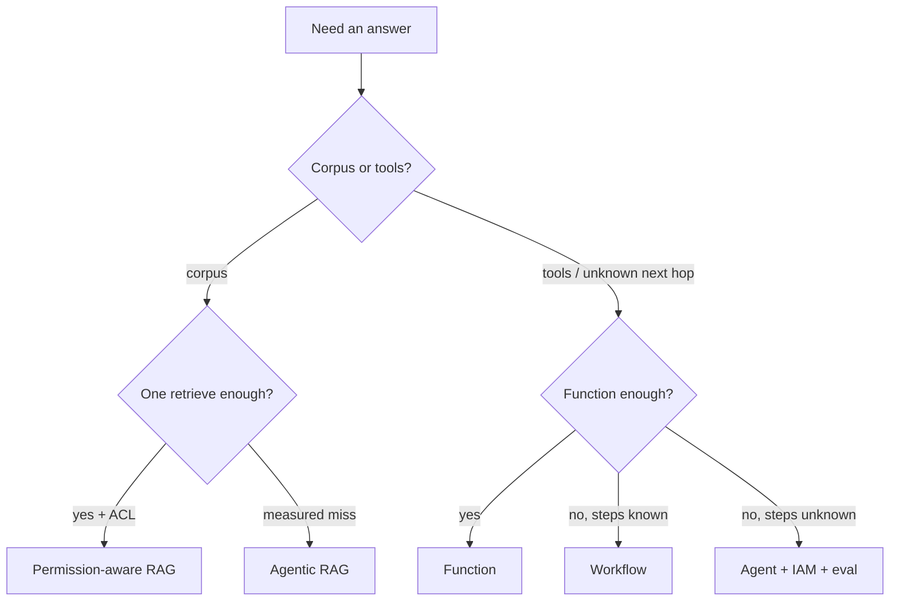

# Cheat-sheet — RAG vs agent

Microsoft Learn: if you can write a function, do that (`SRC-MS-AGENT-FRAMEWORK`). This table is the lab’s durable cut.

| Need | Prefer | First page |
|---|---|---|
| Answer from **your** corpus, one retrieve | RAG | [08](../08-RAG/01-overview.md) |
| Same, but keywords + vectors | Hybrid RAG | [08 comparison](../08-RAG/19-comparison.md) |
| Multi-tenant / classified docs | Permission-aware RAG | [08 comparison](../08-RAG/19-comparison.md) |
| First retrieve measured-wrong, rewrite is ad hoc | Agentic RAG (retrieve-as-tool) | [09](../09-AGENTIC-RAG/01-overview.md) |
| Known rewrite (hyphenate SKU, add synonym) | Workflow, not an agent | [09 when-not](../09-AGENTIC-RAG/19-comparison.md) |
| Next action unknown; tools under uncertainty | Agent | [10](../10-AGENTS/01-overview.md) |
| Steps already enumerated | Workflow / DAG | [10 when-not](../10-AGENTS/19-comparison.md) |
| One classify / extract | Structured LLM app | [05](../05-LLM-APPLICATION-ENGINEERING/01-overview.md) |
| Known lookup | SQL / API / semantic layer | [15 when-not](../15-NL2SQL/19-comparison.md) |

## When not

Do not wrap a single always-called retrieve in an “agent.” That is RAG with extra blast radius (LLM03).
