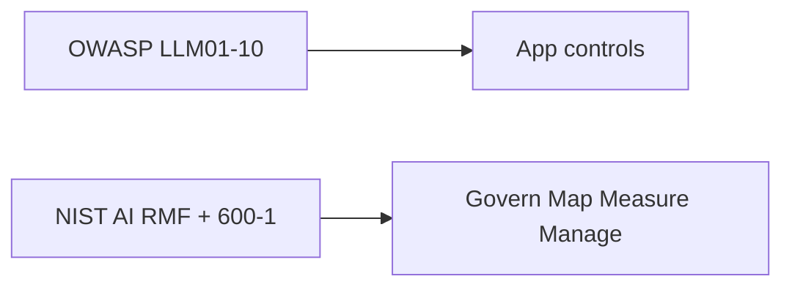

# Cheat-sheet — OWASP LLM Top 10 2026

Official titles from the 2026 GitHub README (`SRC-OWASP-LLM-TOP10-2026-GH`, last verified 2026-09-07). This is a **pointer map**, not a new Top 10. Landing HTML date vs README date disagreement: see Gate 6 scorecard.

| ID | Official title | First lab control |
|---|---|---|
| LLM01 | Prompt Injection | Treat retrieve/tool text as hostile; HITL on writes — [21](../21-AI-SECURITY/02-simple.md) |
| LLM02 | Sensitive Information Disclosure | Secrets out of prompts; DLP in and out — [23](../23-PHI-PII-DLP/01-overview.md) |
| LLM03 | Excessive Agency | Tool IAM, capability budget — [12](../12-TOOLS-FUNCTION-CALLING/01-overview.md) |
| LLM04 | Supply Chain | Pin MCP servers, models, packages — [13](../13-MCP/01-overview.md) |
| LLM05 | Data and Model Poisoning | Ingest provenance; eval after corpus change — [18](../18-EVALUATION/01-overview.md) |
| LLM06 | Unbounded Consumption | Quotas, timeouts, max loops — [38](../38-AI-COST/01-overview.md) |
| LLM07 | Misinformation | Gold cases; no vibe-ship — [18](../18-EVALUATION/02-simple.md) |
| LLM08 | Hidden Context Exposure | Prompt is not authz — [22](../22-GUARDRAILS/01-overview.md) |
| LLM09 | Vector and Embedding Weaknesses | ACL **inside** retrieve — [08 comparison](../08-RAG/19-comparison.md) |
| LLM10 | Improper Output Handling | Encode for the sink; never `exec` model text — [15](../15-NL2SQL/01-overview.md) |

NIST AI 600-1 is the organizational companion, not a second Top 10 (`SRC-NIST-AI-600-1`). Full map: [21/03-logical](../21-AI-SECURITY/03-logical.md).
